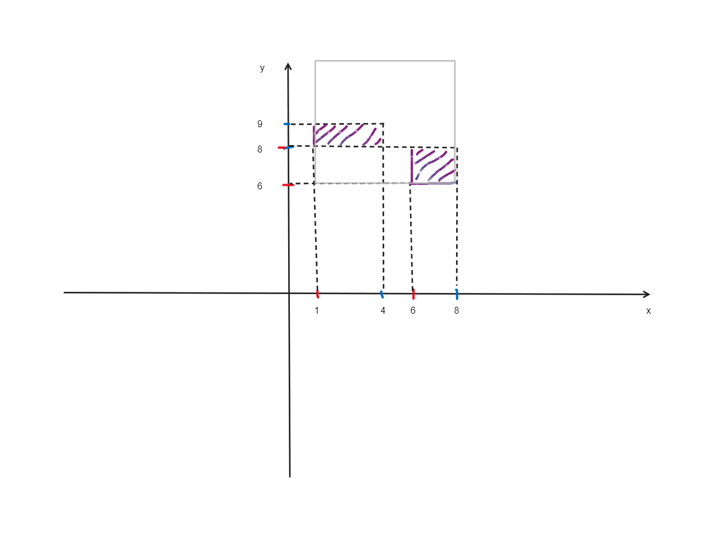

## HÌNH VUÔNG NHỎ NHẤT

Cho 2 hình chữ nhật trên mặt phẳng Oxy. Cần tìm hình vuông có kích thước nhỏ nhất sao cho phủ kín được 2 hình chữ nhật đã cho.

### Dữ liệu vào:

- 2 dòng, mỗi dòng gồm 4 số nguyên lần lượt mô tả điểm trái dưới và phải trên của hình chữ nhật. Các tọa độ có giá trị tuyệt đối không vượt quá 100.

### Kết quả: 

- In ra diện tích của hình vuông tìm được.

### Ví dụ:

| **Input**      | **Output** |
| -------------- | ---------- |
| 6 6 8 8 | 49         |
| 1 8 4 9 | | 

### Minh họa:

